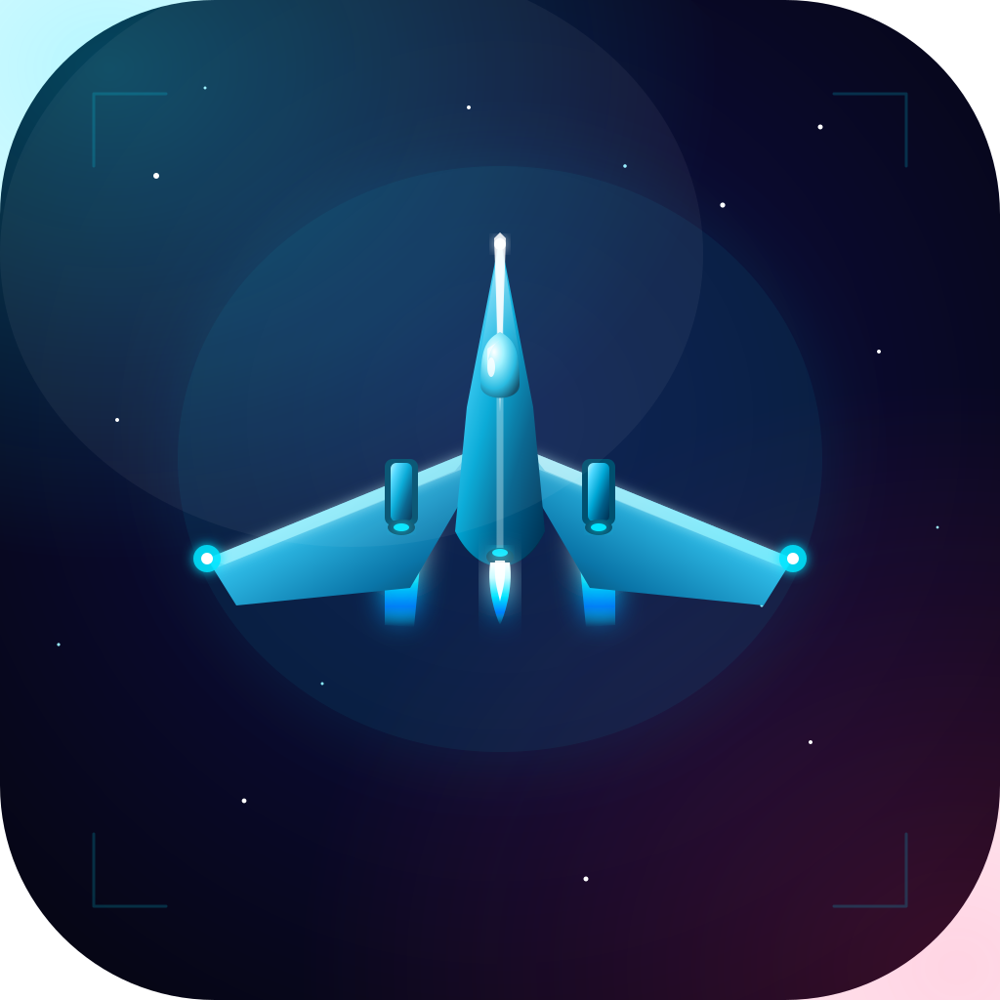

# Space Blaster

A fast-paced arcade space shooter built with React Native (Expo). Dodge enemies, collect power-ups, and survive increasingly difficult waves of alien fighters.



## Features

- **Touch controls** — drag anywhere to move your ship
- **Auto-fire** — constant stream of cyan plasma bolts
- **4 enemy types** — Scout, Fighter, Bomber, and Boss (every 5th wave)
- **3 movement patterns** — straight, zigzag, and swoop
- **5 power-ups** — Shield, Rapid Fire, Multi-Shot, Health, and Score Bonus
- **Combo system** — chain kills for score multipliers
- **Particle FX** — explosions, thruster trails, hit sparks, screen shake
- **Parallax star field** background
- **Progressive difficulty** — enemies scale each wave
- **Continue system** — watch a rewarded ad to resume from where you died
- **Google AdMob** integration — app open, banner, interstitial, and rewarded ads

## Tech Stack

| Layer | Technology |
|-------|-----------|
| Framework | React Native + Expo SDK 57 |
| Language | TypeScript |
| Ad SDK | react-native-google-mobile-ads |
| Architecture | ECS-inspired (entities + game loop + collision detection) |

## Project Structure

```
space-blaster/
├── App.tsx                          # Root — screen routing, ad init
├── src/
│   ├── types.ts                     # All TypeScript interfaces
│   ├── constants.ts                 # Tunable game config
│   ├── utils.ts                     # Math, AABB, random helpers
│   ├── ads/
│   │   ├── adConfig.ts              # Ad unit IDs and placement config
│   │   └── AdService.ts             # Preload/show logic for all ad types
│   ├── game/
│   │   └── collision.ts             # AABB collision detection
│   ├── entities/                    # Pure game logic (no rendering)
│   │   ├── Player.ts                # Movement, health, power-up timers
│   │   ├── Enemy.ts                 # 4 types, 3 patterns, wave spawning
│   │   ├── Bullet.ts                # Player/enemy projectiles
│   │   ├── Particle.ts              # Explosions, thrusters, hit sparks
│   │   └── PowerUp.ts               # 5 power-up types + collection logic
│   ├── rendering/                   # Presentational components
│   │   ├── StarField.tsx            # Parallax scrolling stars
│   │   ├── PlayerShip.tsx           # Ship with wings, cockpit, engines
│   │   ├── EnemyShip.tsx            # Scout/fighter/bomber/boss variants
│   │   ├── BulletView.tsx           # Neon glowing projectiles
│   │   ├── ParticleView.tsx         # Fade-out particles
│   │   ├── PowerUpView.tsx          # Bobbing power-up orbs
│   │   └── HUD.tsx                  # Score, wave, health, active buffs
│   └── screens/
│       ├── MenuScreen.tsx           # Animated logo + banner ad
│       ├── GameScreen.tsx           # Core game loop + interstitial ads
│       └── GameOverScreen.tsx       # Score recap + rewarded continue
├── assets/                          # Icons, splash, logo
│   ├── icon.png                     # App icon (1024x1024)
│   ├── splash.png                   # Launch screen
│   ├── adaptive-icon.png            # Android adaptive icon
│   ├── feature-graphic.png          # Play Store feature graphic
│   └── logo.svg                     # Source logo design
├── PRIVACY_POLICY.md                # App privacy policy
├── generate-icons.js                # Script to regenerate PNG assets from SVG
└── app.json                         # Expo config
```

## Getting Started

### Prerequisites

- Node.js 22+
- Expo CLI (`npm install -g expo-cli`)
- For native builds: Xcode (iOS) or Android Studio (Android)

### Installation

```bash
git clone <repo-url>
cd space-blaster
npm install
```

### Running in Expo Go (dev)

```bash
npx expo start
```

> **Note:** Ads require a native build and will not work in Expo Go.

### Running native builds

```bash
# iOS
npx expo prebuild --clean
npx expo run:ios

# Android
npx expo prebuild --clean
npx expo run:android
```

### Building for release

```bash
npx eas build --platform ios
npx eas build --platform android
```

## Ad Placements

| Ad Type | Trigger | Behavior |
|---------|---------|----------|
| App Open | App launch | Shows after 2s delay on cold start |
| Banner | Menu screen | Visible at bottom of main menu |
| Interstitial | Every 5 waves | Natural break between wave clears |
| Rewarded | Game over | "Watch Ad to Continue" — resumes from saved state |

The app uses **Google test ad IDs** by default. Replace them in `src/ads/adConfig.ts` with your real AdMob unit IDs before publishing.

## Configuration

Key constants are in `src/constants.ts`:

```ts
PLAYER.maxHealth = 5;        // Starting health
PLAYER.fireRate = 200;       // ms between shots
WAVE.bossWave = (wave) => wave % 5 === 0;  // Boss every 5 waves
POWER_UP.dropChance = 0.15;  // 15% drop rate on enemy kill
```

## Regenerating Logo Assets

```bash
node generate-icons.js
```

This reads `assets/logo.svg` and produces all PNG variants (icon, splash, feature graphic, etc.).

## License

See [LICENSE](LICENSE).
